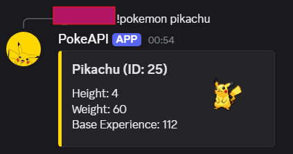
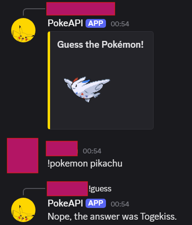

# PokeAPI-Discord-Bot

A C# Discord bot that fetches Pokémon info and plays a guess-the-Pokémon game using PokeAPI.

## Commands

🔍 `!pokemon [name/blank]`  
Shows information about a specific Pokémon by name or fetches a random Pokémon's details if you use `!pokemon`.
    

❓ `!guess`  
Starts a guessing game where the bot displays a hidden Pokémon's image, and you have 10 seconds to guess which Pokémon it is!
    

## How it works

This bot uses the [PokemonApiWrapper](https://github.com/CinnamonYeti459/PokemonApiWrapper) library to interact with the official PokeAPI, retrieving Pokémon data such as stats, sprites, and more.

## Getting Started

- Download the repo
- Download DSharpPlus, DSharpPlus.CommandsNext, DSharpPlus.Interactivity, Newtonsoft.Json and my API wrapper for PokeAPI on my GitHub
- Edit the config.json to include your own bot token
- Invit the bot to your server and have fun

## Coming Soon
- More detailed Pokémon information, including abilities, various sprites (like shiny versions), and additional features.

## License

This project is open source. Feel free to contribute or report issues!
